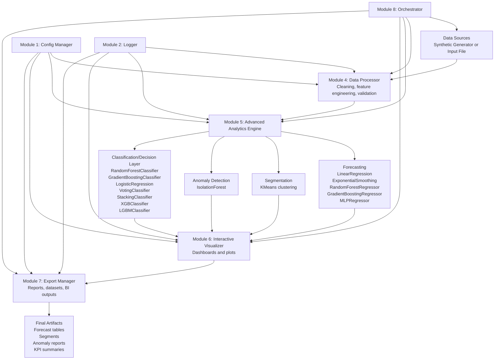
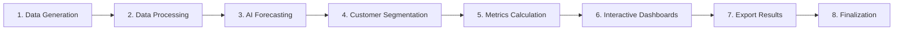
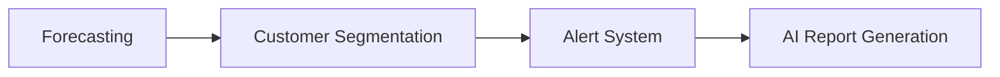
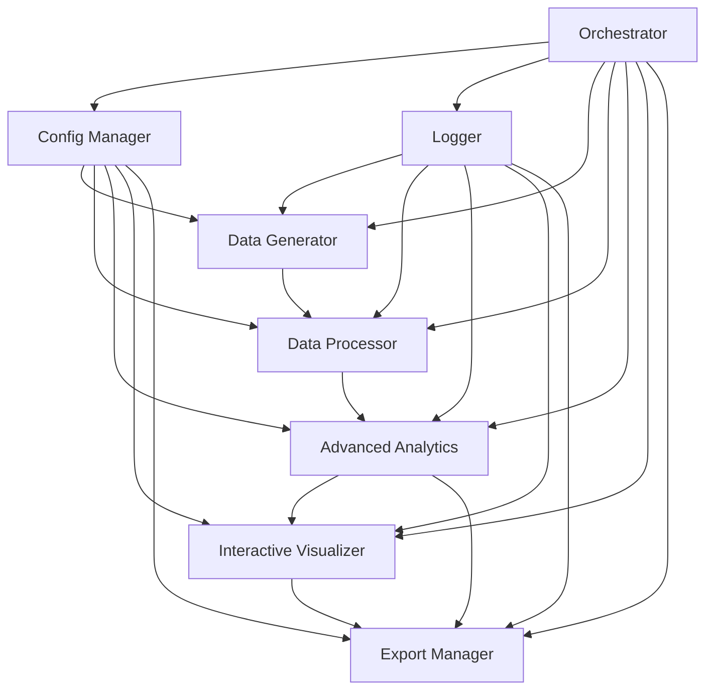
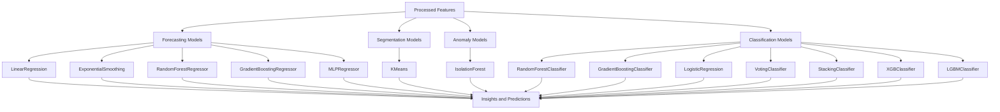
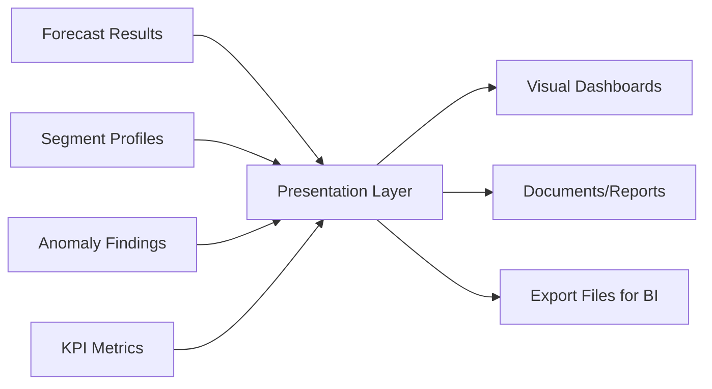

# AutoData Analyst System Architecture Visual

Source notebook: `AutoData_Analyst_v1_aymen.ipynb`

## 1. Full System Overview

## 2. Enterprise Pipeline (8-Step Execution)

## 3. Alternative Pipeline (4-Step AI Flow)

## 4. Module Interaction Map

## 5. Model Layer Visualization

## 6. Output Delivery Map

## 7. Notes
1. This architecture visualization reflects the notebook's multi-phase implementation and enterprise module structure.
2. The notebook contains iterative/generated sections, so some components appear in multiple versions.
3. The model layer above matches the validated unique instantiated model classes in the notebook.
