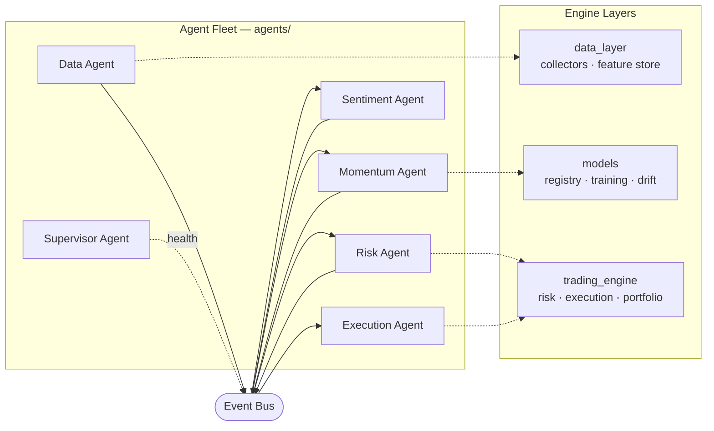

<div align="center">

# ⚡ The Volt System

**An autonomous, agent-based quantitative trading platform — a fleet of specialized agents over a hardened stack for data ingestion, feature engineering, ML prediction, and governed paper execution.**

[](https://github.com/KhaledBakhtriIA/the_volt/actions/workflows/ci.yml)
[](https://github.com/KhaledBakhtriIA/the_volt/actions/workflows/cd.yml)
[](https://www.python.org/)
[](tests/)
[](agents/)
[](api/)
[](models/training/xgb_optuna_pipeline.py)
[](docker-compose.yml)
[](LICENSE)
[]()

</div>

---

## Overview

The Volt System is organized as a **fleet of six autonomous agents** communicating over an in-process **event bus**, each a thin single-responsibility wrapper over a hardened engine layer. Data flows `data → strategy → risk → execution`: agents ingest from **11 data sources**, engineer **150+ features**, score with **XGBoost**, size positions with a Kelly-based **PortfolioRiskModel** (global drawdown kill-switch), and route risk-approved orders through a **TWAP** execution gateway to a simulated broker — every message auditable on the bus.

The engine underneath was refactored out of a 600+ cell research notebook into a **decoupled, fully-tested package**, with a shadow-test suite proving numerical equivalence between the notebook and production code to 5 decimal places.

> **Current maturity:** production-ready **research & paper-trading** platform. Live capital execution (real broker connectivity) is the primary remaining milestone — see the [Roadmap](#-roadmap).

---

## 📊 At a Glance

| Metric | Value |
|---|---|
| **Production Python** | ~8,200 LOC across 57 modules |
| **Autonomous agents** | 6 (data · momentum · sentiment · risk · execution · supervisor) |
| **Test suite** | 190 tests (unit · integration · agent) — **100% passing** |
| **CI/CD** | GitHub Actions → lint · test · frontend · Docker → GHCR |
| **Observability** | Prometheus `/metrics` · Grafana dashboard · alert rules |
| **Data collectors** | 11 (market, macro, news, social, vision) |
| **Feature indicators** | 150+ (momentum, volatility, volume) |
| **Documentation** | 17 architecture & policy documents |
| **Runtime** | Python 3.11 · FastAPI · Redis · Kafka · Docker Compose |

---

## 🏗️ Architecture



---

## 🧩 Agent Fleet — [`agents/`](agents/)

Each agent is a thin wrapper over an engine component and talks to the fleet **only through the [event bus](orchestration/event_bus.py)**, so the system stays decoupled and every hop is testable.

| Agent | Consumes | Produces | Wraps |
|---|---|---|---|
| [`data_agent`](agents/data_agent) | collectors | `market.data`, `news.data` | data_layer collectors |
| [`momentum_agent`](agents/momentum_agent) | `market.data` | `signal` | momentum model |
| [`sentiment_agent`](agents/sentiment_agent) | `news.data` | `signal` | SentimentProcessor |
| [`risk_agent`](agents/risk_agent) | `signal` | `order.sized` / `order.rejected` | PortfolioRiskModel |
| [`execution_agent`](agents/execution_agent) | `order.sized` | `order.filled` | PaperExecutor (TWAP) |
| [`supervisor_agent`](agents/supervisor_agent) | — | fleet health | the fleet |

Orchestration lives in [`orchestration/`](orchestration/): [`agent_orchestrator.py`](orchestration/agent_orchestrator.py) wires the fleet onto a shared bus and runs trade cycles; [`workflow_manager.py`](orchestration/workflow_manager.py) sequences named workflows; [`event_bus.py`](orchestration/event_bus.py) is the pub/sub transport.

## 🧱 Engine Layers

- **[`data_layer/`](data_layer/)** — 11 [collectors](data_layer/collectors), [processors](data_layer/processors), the [feature store](data_layer/feature_store) (`FeatureStoreEngine` quality gate + `FeatureEngineer` 150+ indicators), and [schemas](data_layer/schemas).
- **[`models/`](models/)** — [registry](models/registry) (human-approval gate), [training](models/training) (`XGBOptunaBundle` + learning loop), [evaluation](models/evaluation) (drift KS/PSI, error monitor), and [inference](models/inference).
- **[`trading_engine/`](trading_engine/)** — [risk_management](trading_engine/risk_management) (`PortfolioRiskModel`), [execution](trading_engine/execution) (gateway + TWAP), [strategies](trading_engine/strategies), and [portfolio](trading_engine/portfolio) (paper broker).
- **[`api/`](api/)** — FastAPI [REST gateway](api/rest) and [WebSocket](api/websocket) interface.
- **[`infrastructure/`](infrastructure/)** — [config](infrastructure/config), [database](infrastructure/database), [monitoring](infrastructure/monitoring), and [docker](infrastructure/docker).

---

## 🗂️ Project Structure

```
VOLT_SYSTEM/
├── agents/                # 6-agent fleet (thin wrappers over the engine)
│   ├── data_agent/  momentum_agent/  sentiment_agent/
│   └── risk_agent/  execution_agent/ supervisor_agent/
├── orchestration/         # event_bus · agent_orchestrator · workflow_manager · jobs
├── data_layer/            # collectors · processors · feature_store · schemas
├── models/                # registry · training · evaluation · inference
├── trading_engine/        # portfolio · strategies · execution · risk_management
├── infrastructure/        # config · database · monitoring · docker
├── api/                   # rest (FastAPI) · websocket
├── frontend/              # React + Vite control-plane dashboard
├── tests/                 # unit · integration · agent_tests (190 tests)
├── research/notebooks/    # archived research notebook (shadow-tested)
├── docs/                  # 17 architecture & policy documents
└── README.md
```

---

## 🚀 Getting Started

### Prerequisites
- Python 3.11
- Docker & Docker Compose (for the real-time streaming cluster)

### Installation

```bash
git clone https://github.com/KhaledBakhtriIA/the_volt.git
cd the_volt

python -m venv .venv
source .venv/Scripts/activate      # Windows Git Bash
# .venv\Scripts\Activate.ps1        # PowerShell
# source .venv/bin/activate         # Linux / macOS

pip install -r requirements.txt
cp .env.example .env                 # then fill in provider API keys
```

### Run the test suite

```bash
pytest                          # 190 tests (unit + integration + agent)
pytest tests/agent_tests        # just the agent-fleet tests
```

### Run an agent trade cycle

```python
from orchestration.agent_orchestrator import AgentOrchestrator
from trading_engine.risk_management.risk_management import PortfolioRiskModel

portfolio = PortfolioRiskModel(); portfolio.sync_equity(1_000_000)
orch = AgentOrchestrator(engine, portfolio_model=portfolio)   # engine = seeded FeatureStoreEngine
orch.run_cycle(frame)           # data → signal → risk → execution
print(orch.health())            # supervisor fleet health
```

### Launch the API

```bash
uvicorn api.rest.app:app --reload
# POST /collect/full   — run a batch collection job
# GET  /health         — cluster health
```

### Full streaming cluster

```bash
docker compose up --build            # API + Redpanda + Redis + Prometheus + Grafana
```

See [infrastructure/docker/DOCKER_SETUP.md](infrastructure/docker/DOCKER_SETUP.md) for details.

---

## 🏭 Production Operations

Full runbook: **[docs/DEPLOYMENT.md](docs/DEPLOYMENT.md)**

- **CI** ([ci.yml](.github/workflows/ci.yml)) — every push/PR: `ruff` lint gate, the 190-test suite with coverage, frontend build, and a no-push Docker image build.
- **CD** ([cd.yml](.github/workflows/cd.yml)) — pushes to `main` and `v*` tags build the API image and publish it to **GHCR** (`latest`, `sha-*`, semver tags). Rollback = redeploy a previous immutable `sha-*` tag.
- **Metrics** — the API exposes Prometheus metrics at `/metrics` ([api/rest/metrics.py](api/rest/metrics.py)): request rate/latency histograms by route + build info. Zero-config: instrumentation self-disables if `prometheus_client` is absent.
- **Dashboards & alerts** — `docker compose up` brings Prometheus (`:9090`) and Grafana (`:3000`) with an auto-provisioned **Volt System — API Overview** dashboard and alert rules (`VoltApiDown`, `VoltHighErrorRate`, `VoltHighLatency`) from [infrastructure/monitoring/](infrastructure/monitoring/).
- **MLOps loop** — drift detection (KS/PSI) → Optuna retrain (`NeuroplasticityLoop`) → `PENDING` in the model registry → human approval gate → serve. Details in the runbook.
- **Test reliability intelligence** — every CI run is recorded by [**agent-data-fabric**](https://github.com/KhaledBakhtriIA/agent-data-fabric) (companion project): cross-run flakiness detection and reliability trends over the suite's history, cached across CI runs. Locally: `make reliability`.
- **Make targets** — `make lint · test · reliability · api · up · down · logs` mirror CI locally ([Makefile](Makefile)).

### Control-plane dashboard (React)

A professional React + Vite dashboard in [`frontend/`](frontend/) showcases the
platform metrics alongside a simulated live paper-trading, risk, and drift feed.

```bash
cd frontend && npm install && npm run dev   # http://localhost:5173
```

---

## 🧪 Testing

```bash
pytest                              # full suite (190)
pytest tests/unit                   # fast, no I/O
pytest tests/integration            # I/O: sqlite, parquet, FastAPI
pytest tests/agent_tests            # agent fleet + event bus
```

Tests are organized into `unit/`, `integration/`, and `agent_tests/`. A **shadow test** ([`test_notebook_shadow.py`](tests/integration/test_notebook_shadow.py)) parses the archived research notebook's AST and asserts feature-parity with the production `FeatureEngineer` to `rtol=1e-5`. The agent tests drive the full `data → signal → risk → execution` chain end-to-end.

---

## 🛠️ Tech Stack

**ML/Data** — XGBoost · LightGBM · scikit-learn · statsmodels · Optuna · pandas · NumPy · SciPy
**Serving/Infra** — FastAPI · Redis · aiokafka (Redpanda) · SQLite · Parquet
**Ops** — GitHub Actions · GHCR · Prometheus · Grafana · Docker Compose · ruff · Make
**Viz** — Matplotlib · Seaborn · Plotly

---

## 🗺️ Roadmap

| Area | Status |
|---|---|
| Multi-source ingestion | ✅ Mature |
| Feature store & engineering | ✅ Mature (notebook-verified) |
| XGBoost + Optuna training | ✅ Complete |
| Risk governance & TWAP execution | ✅ Implemented |
| Real-time streaming stack | 🟡 Scaffolded — pending load validation |
| **Live broker connectivity** (IBKR / Alpaca) | 🔜 Planned — currently paper-only |

---

## ⚠️ Disclaimer

The Volt System is a research and educational quantitative-trading platform. It does **not** execute live trades against real capital and ships with a simulated paper broker only. Nothing in this repository constitutes financial advice. Trading involves substantial risk of loss — use entirely at your own risk.

## 📄 License

Released under the [MIT License](LICENSE).
