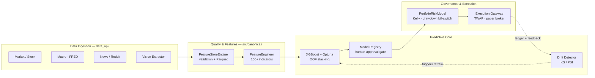

<div align="center">

# ⚡ The Volt System

**An autonomous, multi-source quantitative trading platform — data ingestion, feature engineering, ML prediction, and governed paper execution in one hardened Python stack.**

[](https://www.python.org/)
[](tests/)
[](data_api/)
[](src/canonical/xgb_optuna_pipeline.py)
[](docker-compose.yml)
[](LICENSE)
[]()

</div>

---

## Overview

The Volt System ingests financial data from **11 heterogeneous sources**, validates its integrity through a rigorous statistical quality gate, engineers **150+ deterministic features**, and trains/serves **XGBoost** models to produce market predictions. A dedicated **governance layer** — portfolio risk modeling, Kelly-based position sizing, algorithmic execution (TWAP), and a global drawdown kill-switch — bridges those predictions to a simulated broker with full auditability.

The platform was refactored out of a 600+ cell research notebook into a **decoupled, fully-tested Python package**, with a shadow-test suite proving numerical equivalence between the notebook and the production code down to 5 decimal places.

> **Current maturity:** production-ready **research & paper-trading** platform. Live capital execution (real broker connectivity) is the primary remaining milestone — see the [Roadmap](#-roadmap).

---

## 📊 At a Glance

| Metric | Value |
|---|---|
| **Production Python** | ~8,300 LOC across 61 modules |
| **Test suite** | 180 tests / 34 files / ~3,200 LOC — **100% passing** |
| **Data collectors** | 11 (market, macro, news, social, vision) |
| **Canonical pipeline modules** | 22 |
| **Feature indicators** | 150+ (momentum, volatility, volume) |
| **Documentation** | 17 architecture & policy documents |
| **Runtime** | Python 3.11 · FastAPI · Redis · Kafka · Docker Compose |

---

## 🏗️ Architecture



---

## 🧩 Core Components

### Data Ingestion — [`data_api/`](data_api/)
A fault-isolated FastAPI service orchestrating **11 collectors**. If any provider fails or credentials expire, that collector returns an empty payload and the pipeline degrades gracefully instead of crashing.

`market_collector` · `stock_market_collector` · `macro_collector` · `news_collector` · `reddit_collector` · `trading_strategy_collector` · `trading_mistakes_collector` · `finance_query_stream` · `browser_collector` · `desktop_collector` · `vision_extractor`

Processors: [`sentiment.py`](data_api/processors/sentiment.py) · [`technical_indicators.py`](data_api/processors/technical_indicators.py)

### Feature & Quality Pipeline — [`src/canonical/`](src/canonical/)
- **[`FeatureStoreEngine`](src/canonical/feature_store_engine.py)** — statistical quality gate: column presence, pricing-domain assertions, market-hour gap detection, Z-score outlier flagging, durable Parquet persistence.
- **[`FeatureEngineer`](src/canonical/feature_engineer.py)** — 150+ vectorized indicators, notebook-verified.
- **[`XGBOptunaBundle`](src/canonical/xgb_optuna_pipeline.py)** — XGBoost classification with OOF stacking and budget-aware Optuna sweeps.
- **Real-time scaffolding** — [`realtime_runtime.py`](src/canonical/realtime_runtime.py), [`stream_worker.py`](src/canonical/stream_worker.py), Redis feature cache for low-latency tick scoring.

### Predictive Core — [`src/brain/`](src/brain/)
Pure, side-effect-free math — heavily testable.
- **[`trading_math.py`](src/brain/trading_math.py)** — Kelly criterion, expectancy edge, drawdown.
- **[`features.py`](src/brain/features.py)** — `calculate_std`, `calculate_atr`, `add_3sigma_target`.

### Governance & Execution
- **[`risk_management.py`](src/canonical/risk_management.py)** — `PortfolioRiskModel`: global drawdown kill-switch + Half-Kelly position sizing.
- **[`execution_strategy.py`](src/canonical/execution_strategy.py)** — TWAP order slicing to minimize market impact.
- **[`execution_gateway.py`](src/canonical/execution_gateway.py)** — risk-validated order contracts routed to the paper broker with a SQLite ledger.

### Reliability by Design
- **Orchestrator checkpoints** — failed batch jobs resume from the last successful step.
- **Human-in-the-loop approval** — new models land `PENDING` in the [Model Registry](src/canonical/model_registry.py) until manually promoted.
- **Automated drift retraining** — KS / PSI checks trigger the Optuna trainer when feature deviation exceeds thresholds.

---

## 🗂️ Project Structure

```
the_volt_system/
├── core/                  # Shared feature contract & config
├── data_api/              # FastAPI ingestion service
│   ├── collectors/        #   11 data-source collectors
│   ├── processors/        #   sentiment + technical indicators
│   ├── jobs/              #   pipeline, retention, production runners
│   └── storage/           #   file store
├── src/
│   ├── brain/             # Pure math (Kelly, ATR, targets)
│   └── canonical/         # 22 production pipeline modules
├── tests/                 # 180 tests across 34 files
├── documentation/         # 17 architecture & policy docs
├── research/notebooks/    # Archived research notebook (shadow-tested)
├── scripts/               # Stress tests & utilities
├── docker-compose.yml     # Redpanda + Redis + API cluster
└── Dockerfile
```

---

## 🚀 Getting Started

### Prerequisites
- Python 3.11
- Docker & Docker Compose (for the real-time streaming cluster)

### Installation

```bash
git clone https://github.com/KhaledBakhtriIA/the_volt.git
cd the_volt

python -m venv .venv
source .venv/Scripts/activate      # Windows Git Bash
# .venv\Scripts\Activate.ps1        # PowerShell
# source .venv/bin/activate         # Linux / macOS

pip install -r requirements.txt
cp .env.example .env                 # then fill in provider API keys
```

### Run the test suite

```bash
pytest              # 180 tests
```

### Launch the API

```bash
uvicorn data_api.app:app --reload
# POST /collect/full   — run a batch collection job
# GET  /health         — cluster health
```

### Full streaming cluster

```bash
docker compose up --build            # API + Redis + Redpanda
```

See [DOCKER_SETUP.md](DOCKER_SETUP.md) for details.

### Control-plane dashboard (React)

A professional React + Vite dashboard in [`frontend/`](frontend/) showcases the
platform metrics alongside a simulated live paper-trading, risk, and drift feed.

```bash
cd frontend && npm install && npm run dev   # http://localhost:5173
```

---

## 🧪 Testing

```bash
pytest                       # full suite
pytest -m unit               # fast, no I/O
pytest tests/test_trading_math.py -v
```

Markers: `unit`, `integration`, `slow`, `skip_ci`. A **shadow test** ([`test_notebook_shadow.py`](tests/test_notebook_shadow.py)) parses the archived research notebook's AST and asserts feature-parity with the production `FeatureEngineer` to `rtol=1e-5`.

---

## 🛠️ Tech Stack

**ML/Data** — XGBoost · LightGBM · scikit-learn · statsmodels · Optuna · pandas · NumPy · SciPy
**Serving/Infra** — FastAPI · Redis · aiokafka (Redpanda) · SQLite · Parquet
**Viz** — Matplotlib · Seaborn · Plotly

---

## 🗺️ Roadmap

| Area | Status |
|---|---|
| Multi-source ingestion | ✅ Mature |
| Feature store & engineering | ✅ Mature (notebook-verified) |
| XGBoost + Optuna training | ✅ Complete |
| Risk governance & TWAP execution | ✅ Implemented |
| Real-time streaming stack | 🟡 Scaffolded — pending load validation |
| **Live broker connectivity** (IBKR / Alpaca) | 🔜 Planned — currently paper-only |

---

## ⚠️ Disclaimer

The Volt System is a research and educational quantitative-trading platform. It does **not** execute live trades against real capital and ships with a simulated paper broker only. Nothing in this repository constitutes financial advice. Trading involves substantial risk of loss — use entirely at your own risk.

## 📄 License

Released under the [MIT License](LICENSE).
